# **Domain Driven Design 101**
Metin İrden
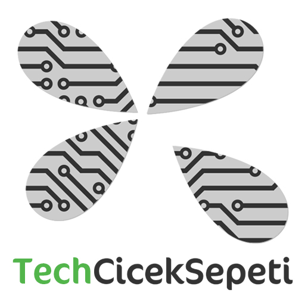

---

> Yazılımın kalbi, kullanıcısı için domain ile ilgili problemlemleri çözebilme yeteneğidir.
## **Eric Evans**

---

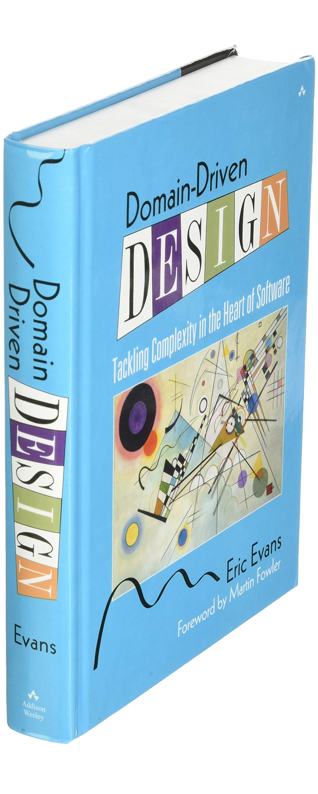

---

Domain-Driven Design (**DDD**) kompleks domain problemlerine sahip yazılımları geliştirmek için bir dil ve domain merkezli bir yaklaşımdır. DDD terimi Eric Evans tarafından “**Domain-Driven Design: Tackling Complexity in the Heart of Software**” kitabında ortaya konmuştur.

DDD hem teknik hem de iş alanlarında karmaşıklığı sahip yazılımları üreten ekiplerin başarıya odaklanması için bazı pattern ve prensiplerden oluşur. 

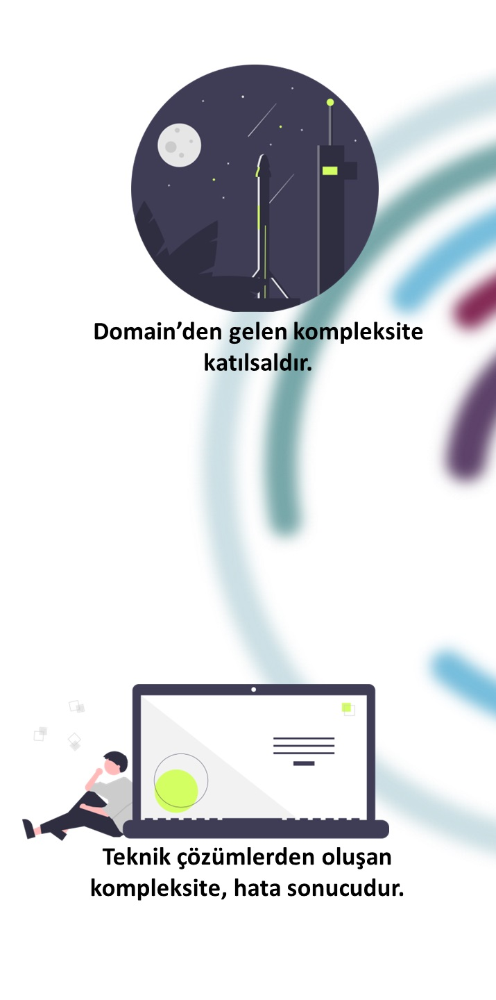

---

Yazılımın sahip olduğu kompleksite, domain'den katılsal olarak gelen kompleksite ile teknik kompleksitenin birleşmesi sonucu ortaya çıkar.

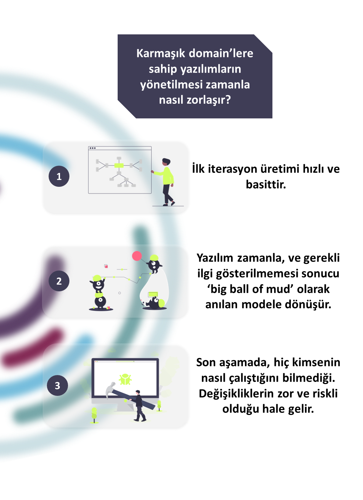

---

#### Kompleks Problemleri Domain Modelleri Kullanarak Çözün

Bir domain modeli gerçekliği değil, bir perspektifi ifade eder. Bu perspektif ise çözülmek istenen problemdir. Bu modelin çeşitli ifadeleri olan kod, diyagram, döküman ise aynı dil ile bağlıdır.

---

Model, yalnızca yaratılan uygulama bağlamındaki sorunları çözmek için ilgili olan detayları içerir.

Yeni use case'ler domain'e dahil oldukça, geçerli kalabilmesi için sürekli olarak gelişmeye ihtiyacı vardır.

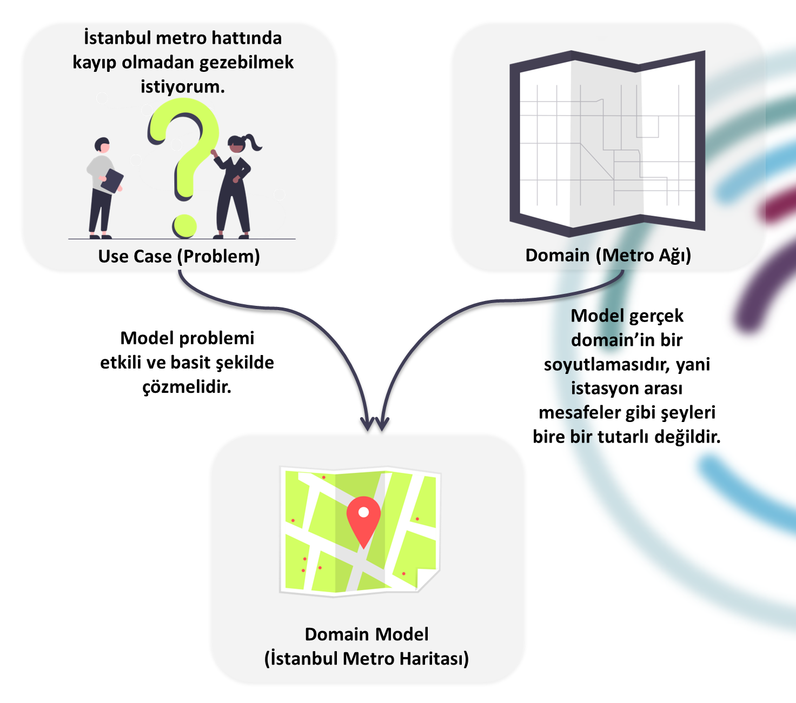

---

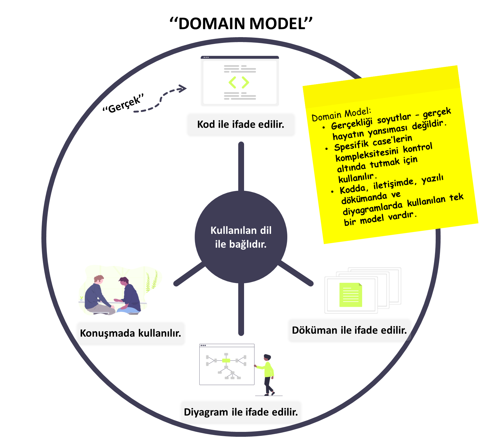

* **İlk İyi Fikrinizde Durmayın.**
* **Her yeni problem ile birlikte modelinizi sorgulayın.**
* **Gerçek Hayatı Modellemeyin.**

---

> Yazılım projelerinin en karmaşık kısmı domain'in kendisini anlamaktır.
#### **Eric Evans**

---

#### Ubiquitous Language Kullanarak Model Dizayn Etmek

Yazılım çözümleri genellikle kötü iletişim ve domain ile teknik dil arasındaki terminoloji farklılıklarından dolayı başarısız sonuçlanır.

---

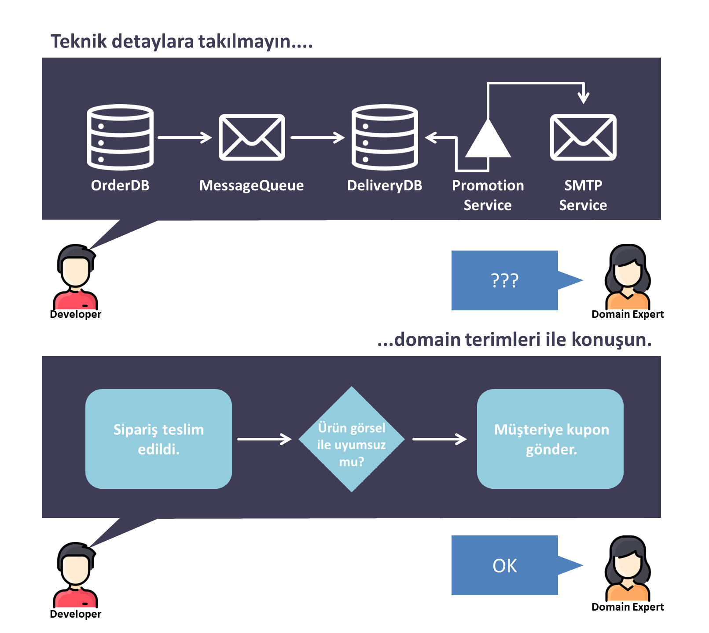

---

Ubiquitous Language, teknik ve domain çeviri maliyetini en aza indirir ve tüm ifadeleri "true model" olarak da bilinen kod modeline bağlar. Paylaşılan bir dil, modelleme sırasında keşiflere de yardımcı olur ve bu, domain'e derinlemesine bir hakimiyet oluşturabilir.

---

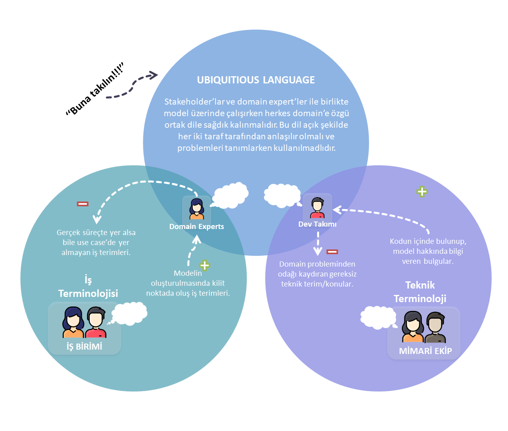

---

#### Kodu Modeli Açıkça İfade Eden Şekilde Yazın

Ubiquitous Language modelin kod implementasyonu yapılırken class isimlerinde, property'lerde ve metod isimlendirmelerinde aynı şekilde kullanılmalıdır. DDD'nin sürekli gelişmesi modeli bu ortak dili kullanmaktan geçmektedir.

---

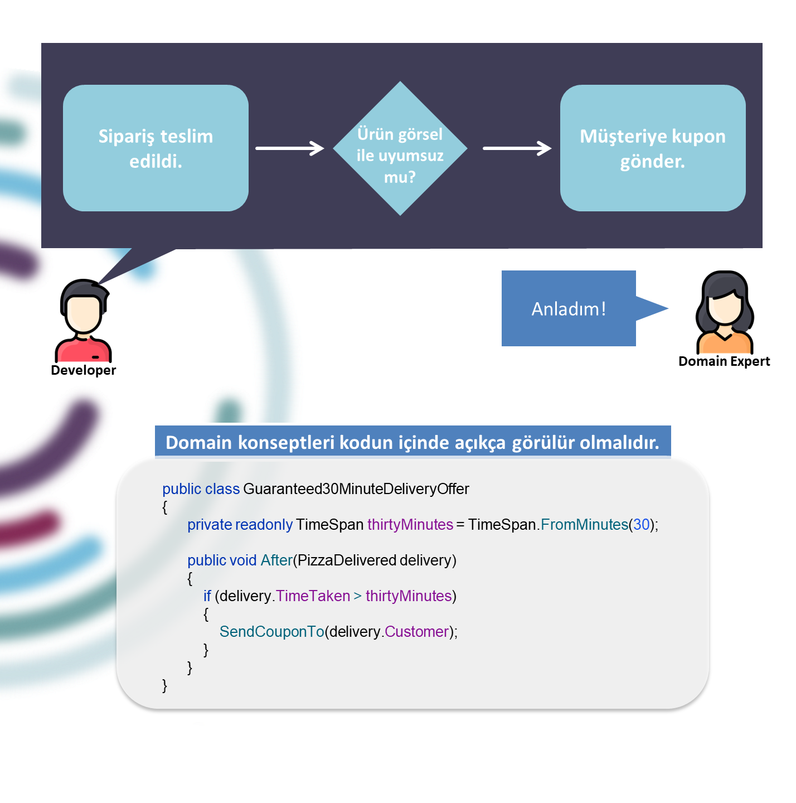

> Herhangi bir programcı, bilgisayarın anlayabileceği şekilde kod yazabilir. İyi programcılar ise insanların anlayabileceği kodlar yazar.
#### **Martin Fowler**

---

#### İşbirlikçi ve Sürekli Gelişen Modelleme

İşbirlikçi modellemenin en büyük yararlarından biri iş birimi tarafından sürekli olarak geri bildirim alıyor olmaktır. Sürekli geri bildirim alıyor olmak, development takımının modelde neyin önemli olup olmadığını fark etmesi için oldukça önemlidir.

---

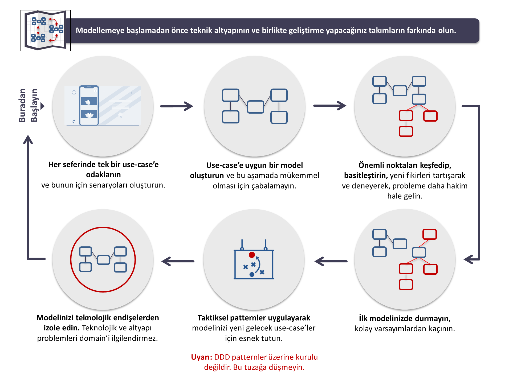

---

#### Karışık ve Büyük Modelleri Bounded Context'lere Ayırın

Zamanla modeliniz bütünlüğünü ve kendini açıkça ifade edebilme özelliğini kaybedebilir, kompleksitesi artar ve üzerinde çalışan takımların kullandığı dil ifadesizleşebilir. Bu durumda, büyük ve kompleks modeller, bir modelin belli bir bağlamda anlaşılabileceği sınırlarda bounded context'lere ayrılmalıdır. Bunu yapamadığınız takdirde ise, yazılımınızın "big ball of mud" modeline dönmemesi ihtimali çok düşüktür.

---

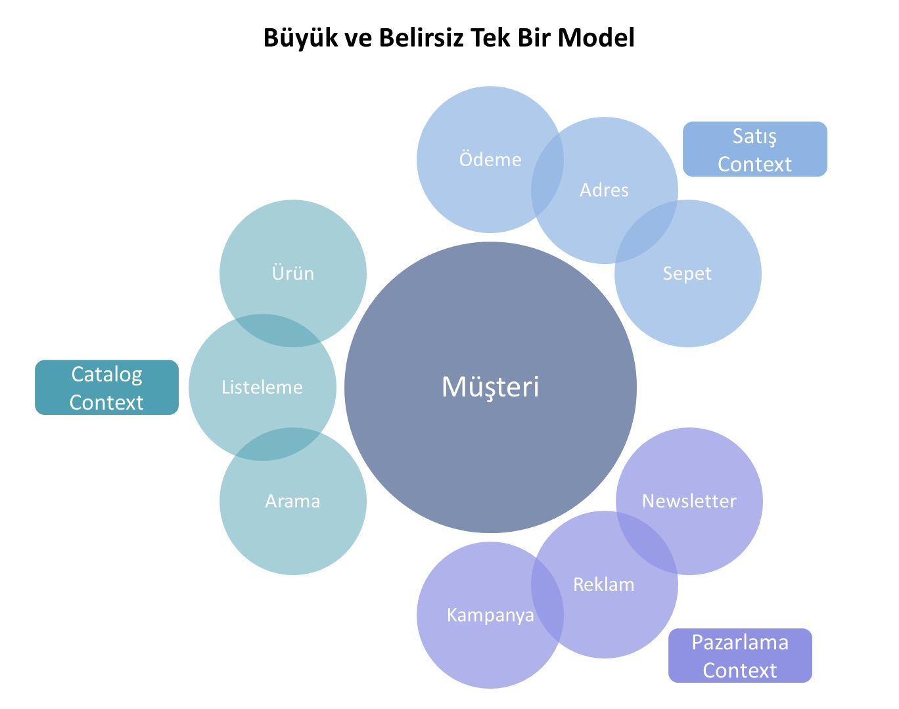

---

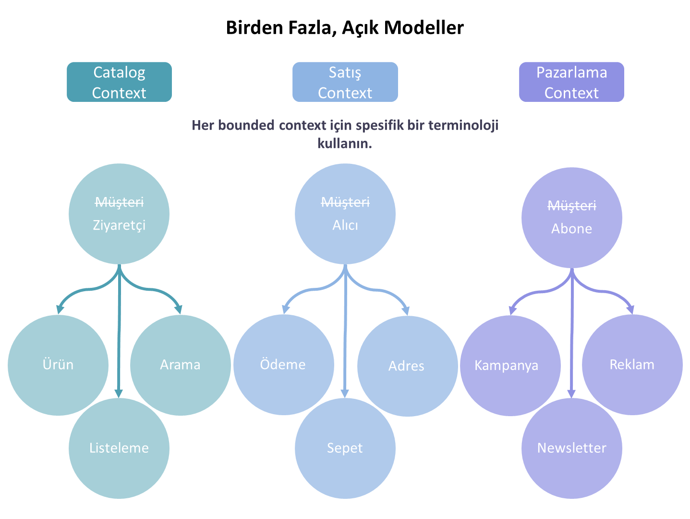

---

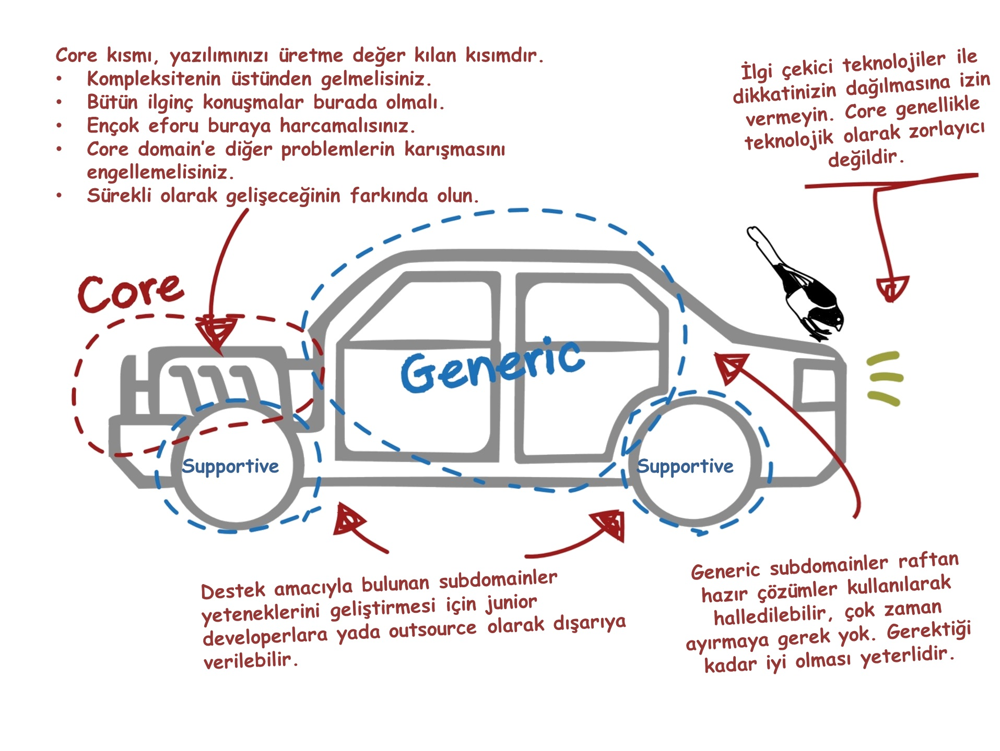

---

#### DDD'nin Avantaj ve Dezavantajları (SOA ve MS için)

SOA ve MS sistemlerin temel farklılıklarından bahsedersek ilk;

- SOA'da daha çok paylaşmayı uygularken, MS olabildiğince daha az paylaşıma yönelir.
- SOA fonksiyonaliteyi olabildiğince tekrar kullanmaktan yanadır. MS'de ise bu durum bounded contextler ile ayrıldığı için tercih edilmez.

DDD ve SOA birlikte uyumlu olabilir. Genellikle servis şemanız/sınırlamalarınız, bounded contextleriniz ile eşleşir. SOA kullanarak contextler arası iletişimi tasarlarsınız yarar. SOA mimari yaklaşımında servisinizin domain'ini nasıl tasarlayacağınıza dair pek bir yönlendirme yoktur ama DDD bu konuyu çözmek için kullanılabilir.

---

Domain'in iyi anlaşılması asla kötü bir şey değildir. Dahası, çoğu entity için ortak bir veri modeli oluşturmayı başarırsanız, standart servisler oluşturabileceksiniz. Böylece veri mapping'i ve dönüştürme ihtiyacını ortadan kaldıracaksınız.

MS tarafı ise, çoğu zaman "fine grained" olarak tanımlanan ve belli bir bounded contextin içinde bile parçalama yaparak oluşturulur.

---

#### DDD'nin Göze Çarpan Noktaları

Kompleks domain'lere sahip yazılımları efektif ve bakım yapılabilir şekilde ortaya koyabilmek için iteratif döngülerle çalışan kendini adamış takımlara ihtiyaç vardır. Eric Evans'ın gözlemlemiş olduğu üzere teknik yetkinlikler size sadece bir yere kadar götürebilir. Problem domain'ine odaklanılmayan, domain expert'leri ile çalışmayan yada ubiquitous language kullanımına dikkat edilmeyen  bir ortam sizi "big ball of mud" modeline sürükleyebilir.

---

#### Önemli Noktalara Efor Harcayın

Her tasarladığınız sistem iyi tasarlanmak zorunda değildir ki sürekli bunu istemek bütçeniz için iyi olmaz. Bunun yerine core domain'inizi tanımlayıp eforunuzu buraya harcamak daha mantıklı olacaktır. Zaten ortaya çıkaracağınız yazılıma yol açan şey core domain'dir.
DDD uygulaması zor ve zaman alıcı bir yöntemdir bu yüzden bazen sadece kodlamaya başlamak, problem olmayan bir yerde problem aramaya çalışmaktan iyidir.

---

#### Bounded Context İçinde Modelleme

Büyük bir domain için modelleri oluştururken, eğer birden fazla ekip varsa, kullanılan dil açıklığını kaybedebilir. Bu yüzden domain ilk olarak context'lere ayrılıp, modelleri bunun üstünden geliştirmelisiniz. Bu noktada context herşeydir; context ve izolasyon kodunuzun bütünlüğünü sağlar ve birden fazla ekibin aynı anda çalışabilmesini sağlar.

---

#### Modelin Kendisini Ubiquitous Language ile İfade Etmesi

Yazılım projeleri kötü iletişim ile birlikte, domain ile teknik terminoloji arasındaki dönüşüm maliyeti yüzünden başarısız sonuçlanabilir.
Ubiquitous Language, development ekibinin kod modelini, domain expert'leri ile yapılan konuşmalar ve diyagramlar gibi ifade şekillerine bağlamasını sağlayarak daha etkili bir iletişim sağlar. Bu nedenle, kod modelinin Ubiquitous Language kullanılarak açıkça ifade edilmesi hayati önem taşımaktadır ve Ubiquitous Language'e takıntılı olmak oldukça önemlidir.

---

#### Modelleme ve Gelişimde İşbirliği

Yazılımcılar ile domain expert'lerinin sürekli olarak iş birliği içinde olması ile ortaya çıkan öğrenmenin göz ardı edilmemelidir. Bilginin yoğun şekilde paylaşılması sürekli olarak devam edecek bir süreçtir, bir projenin başlaması gibi olaylar ile sınırlı kalmamalıdır. Derin bilgi hakimiyeti, problemli domain üstünde ancak sürekli olarak geliştirme döngüsü sonucunda elde dilebilir. "Çalışan yazılım genellikle öğrenmenin çıktısıdır" şeklinde de söylenebilir.

---

> # Teşekkürler :zap:
